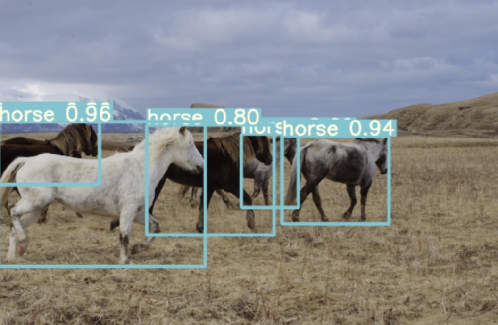

# Human Object Tracking 

## Introduction

In the realm of computer vision, object tracking stands as a crucial application, pivotal in realms ranging from surveillance to autonomous driving. This project harnesses the power of state-of-the-art models, integrating YOLOv7 for object detection with StrongSORT and OSNet for robust and precise object tracking. The integration aims to enhance tracking accuracy and real-time performance, making it particularly valuable in scenarios where human object tracking is critical.

Our approach leverages YOLOv7 for its exceptional capability in detecting objects with high accuracy and speed. For the tracking component, we employ StrongSORT, which enhances the SORT (Simple Online and Realtime Tracking) algorithm by integrating more powerful features and association metrics. To further boost the tracking performance, OSNet is utilized for its cutting-edge deep learning architecture designed for re-identifying objects, ensuring that the tracked subjects are followed accurately across different frames, even in challenging conditions.

## Yolov7 + StrongSORT with OSNet

<div align="center">
<p>
  
</p>
<br>  
<a href="https://colab.research.google.com/drive/101f0PNBPx3245Hu710QAf2LXpf3E2uIk?usp=sharing"></a>
</div>

</div>

## Technical Architecture and Implementation

This project employs a sophisticated blend of technologies to achieve high-performance human object tracking. At the core of this system is the YOLOv7 model, known for its precision and speed in object detection. The model allows users to select from various configurations, balancing between inference speed and accuracy to cater to diverse application needs. This flexibility ensures optimal performance across different computational environments and real-time requirements.

Complementing the detection capabilities of YOLOv7, the StrongSORT algorithm, integrated with OSNet models for Re-Identification (ReID), ensures continuous and accurate tracking of objects even in densely populated scenes. The ReID models, available from a curated model zoo, can be chosen based on the specific demands of the tracking task, enhancing the robustness of the identity tracking across various scenarios.

## Setup and Usage

To utilize this tracking system, users are required to clone the repository and install dependencies, ensuring a seamless setup with Python 3.8 or later. The system supports tracking from multiple sources including webcams, static images, video files, directories, glob patterns, YouTube videos, and even live streams via RTSP, RTMP, or HTTP. This versatility is crucial for deployment in diverse environments, from academic research to industrial applications.


1. We can clone the repository recursively:

`git clone --recurse-submodules https://github.com/mikel-brostrom/Yolov7_StrongSORT_OSNet.git`


2. Ensure you meet all prerequisites: 
   Python version 3.8 or newer with all dependencies listed in requirements.txt
   To install them, execute the following command:
   
`pip install -r requirements.txt`

3. Tracking can be run on most video formats

```bash
$ python track.py --source 0  # webcam
                           img.jpg  # image
                           vid.mp4  # video
                           path/  # directory
                           path/*.jpg  # glob
                           'https://youtu.be/Zgi9g1ksQHc'  # YouTube
                           'rtsp://example.com/media.mp4'  # RTSP, RTMP, HTTP stream
```


## Select object detection and ReID model

### Yolov7

There is a clear trade-off between model inference speed and accuracy. In order to make it possible to fulfill your inference speed/accuracy needs
you can select a Yolov7 family model for automatic download

```bash


$ python track.py --source 0 --yolo-weights yolov7.pt --img 640
                                            yolov7x.pt --img 640
                                            yolov7-e6e.pt --img 1280
                                            ...
```

### StrongSORT

The above applies to StrongSORT models as well. Choose a ReID model based on your needs from this ReID [model zoo](https://kaiyangzhou.github.io/deep-person-reid/MODEL_ZOO)

```bash


$ python track.py --source 0 --strong-sort-weights osnet_x0_25_market1501.pt
                                                   osnet_x0_5_market1501.pt
                                                   osnet_x0_75_msmt17.pt
                                                   osnet_x1_0_msmt17.pt
                                                   ...
```


## Filter tracked classes

By default, the tracker monitors all MS COCO classes.

The users can also filter the tracked object classes to focus on specific entities, like animals or vehicles. This functionality is particularly useful in specialized tracking applications where only certain object classes are of interest.

To track a specific subset of MS COCO classes, append their respective indices after the classes flag.


```bash
python track.py --source 0 --yolo-weights yolov7.pt --classes 19 20  # tracks horse and sheep only
```

You can find a comprehensive list of all the objects detectable by a Yolov7 model trained on MS COCO here (https://tech.amikelive.com/node-718/what-object-categories-labels-are-in-coco-dataset/). 
Note that the indexing for classes in this repository begins at zero.


## Save Multiple Object Tracking Compliant Results
You can save MOT-compliant results to your experiment folder at `runs/track/<yolo_model>_<deep_sort_model>/` using the following command:

```bash
python track.py --source ... --save-txt
```

## Code Understanding


